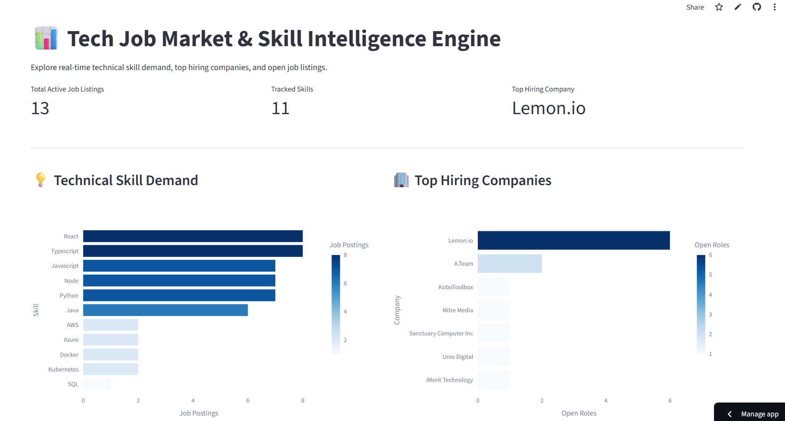
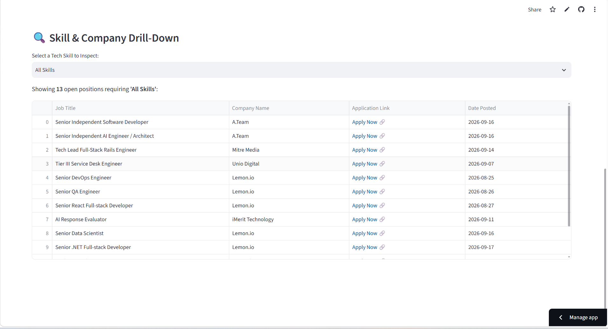

# Dashboard

🔗 **Repository:** [github.com/Vaishnavi698/tech-job-market-analyzer](https://github.com/Vaishnavi698/tech-job-market-analyzer) 🗓️ **Last Updated:** September 2026

An automated Python, SQLite, and Streamlit analytics engine designed to extract live tech job postings, evaluate technical skill demand trends, and map company hiring stacks.

**Keywords:** `tech job market` · `skill demand analysis` · `etl pipeline` · `sqlite relational db` · `streamlit dashboard` · `plotly visualization` · `data engineering` · `regex skill extraction` · `rest api integration`

---

## 📌 Project Overview

Understanding technical skill demand is critical for software engineering and data career planning. This project provides an automated data pipeline that transforms live remote job postings into actionable skill intelligence through:

* **Automated Data Pipeline** — Python ETL pipeline using `requests` to ingest live jobs from the Remotive REST API and regex matching (`re`) to extract technical skill occurrences.
* **Relational Database Management** — Persistent SQLite schema (`jobs_data.db`) featuring foreign key constraints between primary job postings (`jobs`) and extracted skills (`job_skills`).
* **Interactive Intelligence Dashboard** — A multi-chart Streamlit dashboard built with Plotly Express for horizontal demand bar charts, top hiring company breakdowns, and direct job application links.

---

## 🖼️ Dashboard Preview

<table>
  <tr>
    <td width="50%">
      <h4 align="center">1. Skill & Company Analytics</h4>
      
    </td>
    <td width="50%">
      <h4 align="center">2. Skill Drill-Down Table</h4>
      
    </td>
  </tr>
</table>

*Interactive Streamlit dashboard displaying tracked tech skills, top hiring companies, horizontal skill demand bar charts, and dynamic skill drill-down tables.*

---

## 📁 Repository Structure & File Descriptions

| File / Folder | Type | Description |
| :--- | :--- | :--- |
| `main.py` | Python Script | Fetches live postings from REST API, applies keyword filtering, extracts skills via regex, and populates `jobs_data.db`. |
| `app.py` | Streamlit App | Interactive web application featuring KPI metrics, Plotly visualizations, skill selector dropdowns, and drill-down tables. |
| `jobs_data.db` | SQLite DB | Binary SQLite relational database containing `jobs` metadata and `job_skills` mapping tables. |

---

## 🛠️ Tech Stack & Requirements

* **Language:** Python 3.10+
* **Data Processing & Storage:** `pandas` , `sqlite3` , `requests` , `re`
* **Web & Visualization:** `streamlit` , `plotly`
* **Version Control & CI/CD:** Git, GitHub, Streamlit Cloud

---

## 🚀 Getting Started

### 1. Clone the Repository

```bash
git clone [https://github.com/Vaishnavi698/tech-job-market-analyzer.git](https://github.com/Vaishnavi698/tech-job-market-analyzer.git)
cd tech-job-market-analyzer